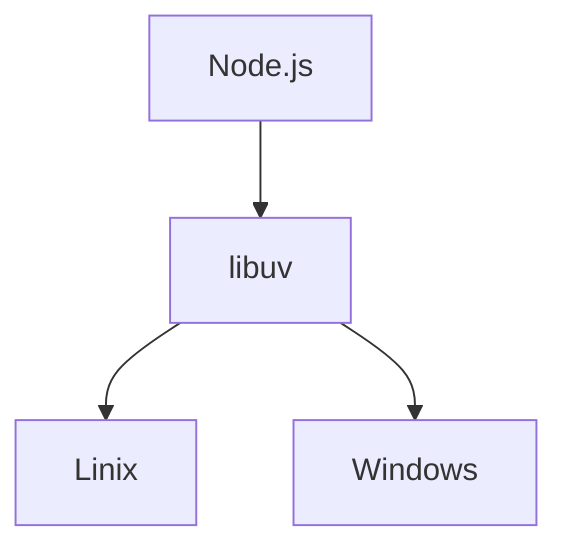

Node作者Ryan Dahl此前是一位资深C/C++程序员。之所以编写Node是因为最初的目标是写一个基于事件驱动、非阻塞I/O的Web服务器来达到更高的性能。
*起初，Ryan Dahl称他的项目为web.js，就是一个web服务器，但是Node项目的发展超出单纯开发一个web服务器的想法，变成了构建网络应用的基础框架。*

<!-- more -->

### Node简介

#### 起源

Node作者Ryan Dahl此前是一位资深C/C++程序员。之所以编写Node是因为最初的目标是写一个基于事件驱动、非阻塞I/O的Web服务器来达到更高的性能。

Ryan Dahl曾评估过C、Lua、Haskell、Ruby等语言作为备选实现，但他得到以下结论：

- C：开发门槛高，开发者可能不太会用于它来写日常业务。
- Haskell：作者当时觉得自己还不能玩转它，则放弃此选。
- Lua：本身有很多阻塞I/O库，再为它构建非阻塞I/O也不能改变人们之前的习惯。
- Ruby：其虚拟机性能不好，落选。

相比之下，JavaScript开发门槛比C低，比Lua历史包袱少（Node出之前，JS没有被后端场景使用，历史包袱为零）。这样使用非阻塞I/O简直没有额外阻力。再者其广泛的事件驱动应用，符合作者喜好基于事件驱动的需求。

- 基于V8引擎高性能
- 符合事件驱动
- 没有历史包袱

3个主要原因，JavaScript成为了Node的实现语言。

*起初，Ryan Dahl称他的项目为web.js，就是一个web服务器，但是Node项目的发展超出单纯开发一个web服务器的想法，变成了构建网络应用的基础框架。*

#### 特点

##### 异步I/O事件与回调函数

```javascript
var fs = require('fs')
fs.readFile('/path', function(err, file){
    console.log('读取完成')
})
console.log('读取文件')
```

以上“读取文件”在“读取完成”前输出。即每个调用之间无需等待之前的I/O调用结束。在编程模型上可以极大提升效率。

而对于同步I/O而言，它们以下两个文件的读取耗时之和，而异步I/O耗时取决于最慢的那个文件读取的耗时。

```javascript
fs.readFile('/path1', function(err, file){
    console.log('读取文件1完成')
})
fs.readFile('/path2', function(err, file){
    console.log('读取文件2完成')
})
```

##### 单线程

Node保持了JavaScript在浏览器端单线程的特点：

- 无法与其它线程共享状态。
- 不用在意状态间的同步问题。
- 没有死锁的存在，没有线程上下文切换带来性能上的开销。

同样，单线程也有它的弱点：

- 无法利用多核CPU（如今有其它解决方案）。
- 错误会引起整个应用退出，考验程序的健壮性。
- 大量计算CPU导致无法继续调用异步I/O。

在Node中遇到CPU占用导致后续异步IO发不出调用，已完成的回调函数也得不到及时执行（JS事件循环机制）。

在浏览器端，当时Google推出Gears的解决方案，它启动一个独立的进程，需要计算的程序发送给它，得出结果后通过事件回调传递回来。后来HTML5定制了Web Workers的标准，Google放弃了Gears，全力支持Web Workers。

而在Node这边，采用了与Web Workers相同的思路来解决单线程中大量计算的问题：child_process。

child_process: 将计算分发到各个子进程，通过进程之间事件消息来传递结果，使用Master-Worker管理方式保持健壮性。

##### 跨平台

早期Node只能在Linux上运行，随着发展，微软开始重视Node的存在，投入了一个团队帮助Node实现在Window平台的兼容。
好在Node在系统之间构建了一层平台架构，即：libuv，Node基于libuv实现跨平台的架构示意图：




#### 应用场景

技术选型前，需要了解新技术适合什么场景，关于Node，探讨较多的在于IO密集和CPU密集。

##### I/O密集型

本身Node就是异步IO，优势在于Node利用事件循环的处理能力，而不是启动每一个线程为每一个请求服务，资源占用极少。Node处理IO的能力是值得喊666的。

##### 不擅长CPU密集型业务？

实际上，V8执行效率十分高。计算n=40的斐波那契数，Node如果使用C++模块计算，是仅次于C系列语言的。而在默认情况下也不会落下Golang太多。

关于CPU密集应用，Node异步IO已经解决了单线程CPU与IO之间阻塞无法重叠利用的问题，对于长时间的计算它的耗时超过普通阻塞IO的耗时，那么应用场景就要重新评估。

Node虽然没有提供多线程用于计算支持，但还有以下两个方式来利用CPU：

- 编写C/C++拓展。
- 子进程计算，消息传递结果。

**CPU密集不可怕，如何合理调度是诀窍。**